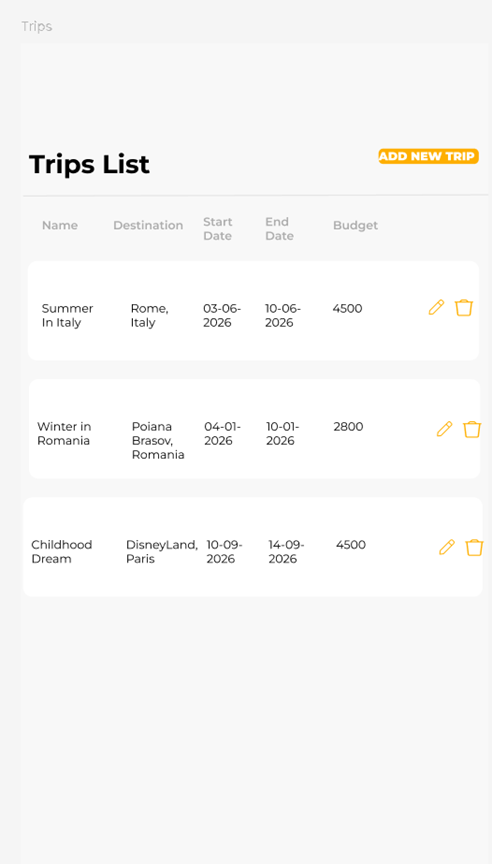
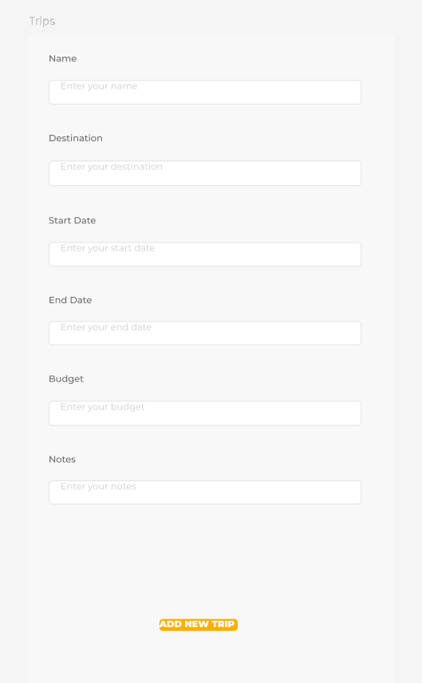

# ✈️ TripMate

## Short Description

**TripMate** is a mobile application, designed to help travelers plan and organize their trips effortlessly.  
Users can record trip details such as destination, travel dates, total budget, and personal notes — all in one clean, easy-to-use interface.  
Whether it’s a short weekend escape or a month-long adventure, **TripMate** helps users stay organized, track their plans, and enjoy a stress-free travel experience.

---

## Domain Details

### Entity: Trip

Each **Trip** represents a planned or completed journey with the following fields:

| **Field Name** | **Description** | **Type** |
|-----------------|-----------------|-----------|
| **ID** | A unique identifier automatically generated for each trip. | String |
| **Name** | The name of the trip chosen by the user (e.g., “July in Italy”). | String |
| **Destination** | The main location or destination of the trip. | String |
| **StartDate** | The date when the trip begins. | Date |
| **EndDate** | The date when the trip ends. | Date |
| **TotalBudget** | The total budget planned by the user for this trip. | Double |
| **Notes** | Optional notes or comments added by the user (e.g., reminders, packing lists, etc.). | String |

---

## CRUD Operations

TripMate provides full CRUD functionality for managing trips:

* **Create:** Users can add a new trip by entering its name, destination, start and end dates, total budget, and optional notes.  
* **Read:** Users can view a list of all trips and access detailed information for each one.  
* **Update:** Users can edit existing trips to modify details such as dates, destination, or budget.  
* **Delete:** Users can remove a trip permanently when it’s no longer needed.

---

## Persistence Details

TripMate uses a **hybrid persistence model**, combining **local storage (Realm)** and **cloud storage (Firebase)** for reliability and synchronization:

* **Local Database (Realm):**  
  All CRUD operations are performed locally first to ensure instant responsiveness and offline access.  

* **Server (Firebase Cloud Firestore):**  
  Create, Update, and Delete operations are also synchronized with the Firebase server to securely back up user data and enable access across multiple devices.  
  Read operations primarily query the local database for performance reasons, but can fetch updates from Firebase when online.

---

## Offline Access Scenarios

TripMate is designed to work seamlessly even without an internet connection, by storing all data locally and synchronizing automatically once connectivity is restored.

| **Operation** | **Offline Behavior** |
|----------------|----------------------|
| **Create** | New trips are stored in the local Realm database. When the device reconnects to the internet, the trip is uploaded to Firebase automatically. |
| **Read** | Users can browse all their trips offline since data is cached locally. The app checks Firebase for newer data when online. |
| **Update** | Edits to trips made offline are stored locally and later synced with Firebase to update the corresponding record. |
| **Delete** | Trips deleted offline are removed locally first and queued for deletion on Firebase once online access resumes. |

Figma mocks can be accessed using this link: ```https://www.figma.com/design/KEg0Qq4k7PcdMRj8Cpb9xh/Untitled?node-id=0-1&t=5YSmDvcZAlCUjPLn-1```
---

---

